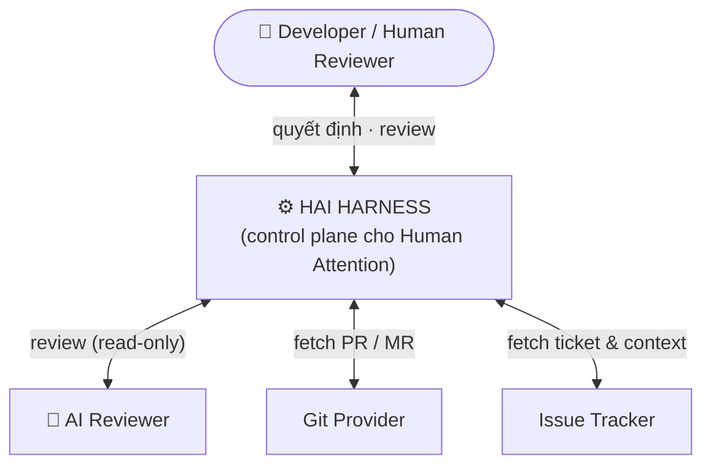
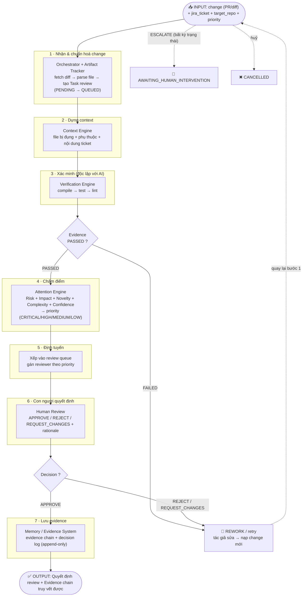
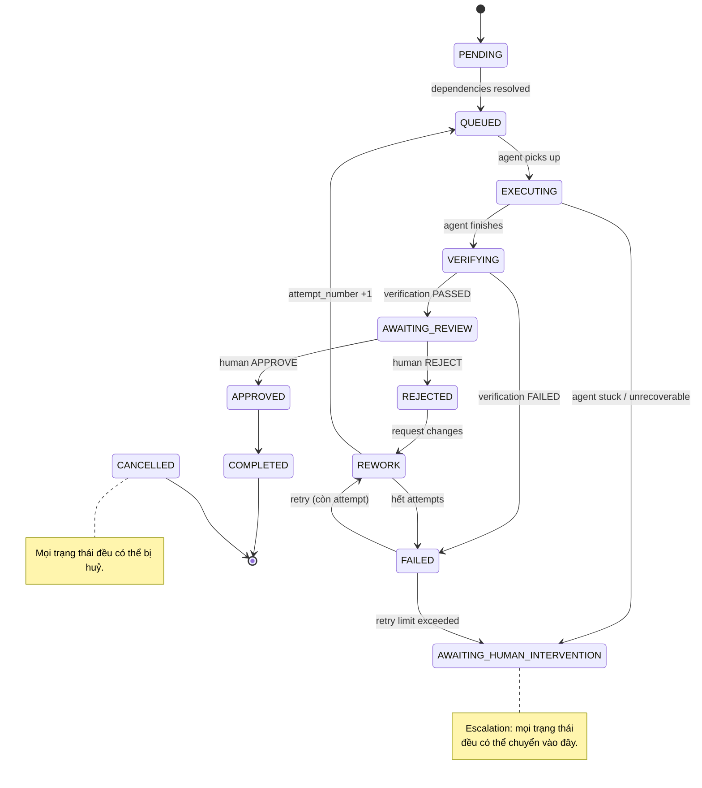
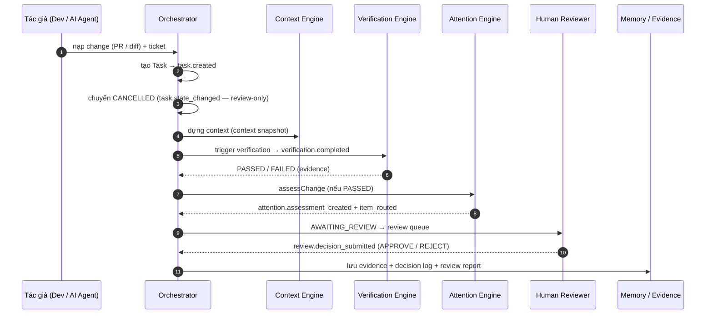
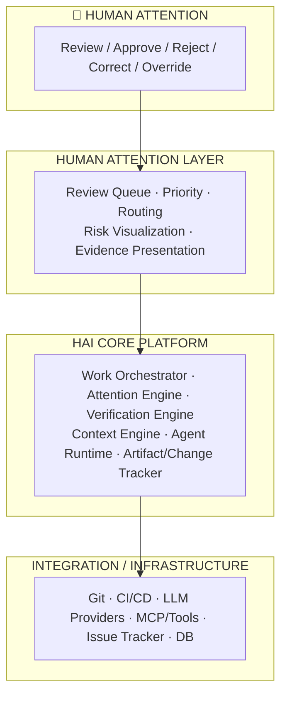

# HAI Harness — Tổng quan Flow Hoạt động

> **`review-reorient` (v0.6):** đường code-gen đã nghỉ hưu — flow dưới đây phản ánh hướng **review PR/MR bên ngoài**: AI là *reviewer* (đọc, không ghi), không còn "AI tự sinh fix".

> **Human Attention Infrastructure (HAI) Harness** — nền tảng AI-native quản lý và tối ưu hóa *"sự chú ý của con người"* trong phát triển phần mềm:
> một code change (PR/MR) đi vào → Harness quan sát, xác minh, đánh giá, dùng AI review, xếp ưu tiên và định tuyến tới đúng sự chú ý của con người.

Nguồn: `docs/summary/HAI_overview.md`, `docs/architecture/HAI_Harness_Architecture_v0.6.md`, `packages/orchestrator/README.md`, `packages/attention-engine/README.md`.

---

## 1. System Context — HAI ở giữa Con người và AI



Harness là **mặt phẳng điều khiển** nằm giữa: `Con người ↕ Harness ↕ AI + Môi trường phát triển`.

---

## 2. Core Loop — "Code change vào, Harness review & kiểm soát"

Vấn đề cốt lõi: **code change (PR/MR) sinh ra nhanh hơn con người có thể kiểm tra → Human Attention trở thành nút cổ chai.**

```mermaid
flowchart TB
    AIOUT["Code Change<br/>(PR / MR — human- or AI-authored)"]
    OBS["🔍 Observation<br/>(fetch diff + metadata)"]
    UND["📖 Understanding<br/>(Context Engine)"]
    VER["✅ Verification<br/>(compile → test → lint)"]
    RISK["⚠️ Risk / Impact Analysis<br/>(Attention Engine)"]
    P ("Prioritization<br/>(xếp thứ tự review)")
    DEC["👤 Human Decision<br/>(APPROVE / REJECT / REWORK)"]
    EVID["🗂️ Evidence / Memory<br/>(append-only, truy vết)"]
    NEXT["🔁 Next Review"]

    AIOUT --> OBS --> UND --> VER --> RISK --> P --> DEC --> EVID --> NEXT --> AIOUT
```

Milestone then chốt (Spec 1 §24): `AI Change → Evidence → Risk → Human Attention → Decision → Learning`.

---

## 3. End-to-end Flow — 7 bước xử lý (Input → Output)

Đầu vào là **một code change cần review** (diff/PR) + context (`jira_ticket`). Luồng chính:



> **Nhánh phụ:** `REQUEST_CHANGES` → tác giả sửa → nạp change mới (quay lại bước 1). Mọi trạng thái có thể ESCALATE → `AWAITING_HUMAN_INTERVENTION`.

---

## 4. Task State Machine — 13 trạng thái canonical (Spec 2)

> **`review-reorient` note.** State machine giữ nguyên, nhưng driver dispatch/workflow/retry đã nghỉ hưu; luồng live tạo Task rồi chuyển ngay `CANCELLED`.



**Bất biến (Spec 2):**
- Chuyển trạng thái dùng **optimistic locking** (`UPDATE ... WHERE id AND state = expected` → `StateConflictError`).
- `attempt_number` chỉ tăng khi `REWORK → QUEUED`; idempotency key = `task_id:attempt_number`.
- Mọi transition ghi vào `task_state_history` (audit).

Terminal: `COMPLETED`, `CANCELLED`.

---

## 5. Attention Engine — Logic quyết định review

```mermaid
flowchart TB
    IN2(["Change arrives for review"]) --> CALC["Tính AttentionAssessment<br/>Risk · Impact · Novelty · Complexity · Confidence"]

    CALC --> FORMULA["combined_priority =<br/>0.35·risk + 0.25·impact + 0.15·novelty<br/>+ 0.10·complexity + 0.15·(1 − confidence)"]

    FORMULA --> D{"combined_priority<br/>≥ threshold ?"}
    D -- "YES" --> REQ["🔴 REVIEW REQUIRED"]
    D -- "NO" --> POL{"Policy rules ?"}
    POL -- "ALWAYS_REVIEW" --> REQ
    POL -- "NEVER_REVIEW / auto-approve" --> AUTO["🟢 AUTO-APPROVE<br/>(skip human)"]

    REQ --> QUEUE["Vào review queue<br/>(budget + adaptive thresholds)"]
    QUEUE --> FEED["Feedback was_useful<br/>→ recalibrate weights"]
```

Labels: **CRITICAL ≥ 0.80 · HIGH ≥ 0.60 · MEDIUM ≥ 0.30 · LOW < 0.30**. Factor thiếu → redistribute trọng số + ghi `factors_unavailable`; thiếu hết → mặc định HIGH (*fail toward attention*).

---

## 6. Event-Driven Timeline — auditable



Mọi event persist **append-only** vào `event_log` (idempotent), join theo `correlation_id`.

Envelope chuẩn: `{ event_id (UUIDv7), event_type, event_version, occurred_at, correlation_id, payload }` — naming `<domain>.<entity>_<verb_past_tense>`.

---

## 7. Kiến trúc 4 lớp



---

## 8. Lộ trình (đã hoàn tất)

Toàn bộ lộ trình xây dựng (Core Loop → Calibrate & Measure → Learn & Automate) đã hoàn tất, tagged `v0.4.0-harness` (`EXIT-WITH-CARRYFORWARD`, 8/9 exit criteria). Lịch sử phân kỳ theo ngày (`docs/plan/`) đã được gỡ bỏ; tổng kết exit ở `docs/retros/phase3-exit-review.md`.