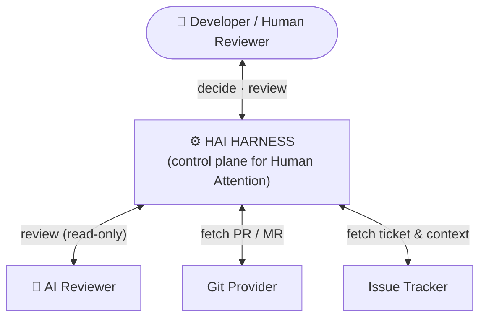
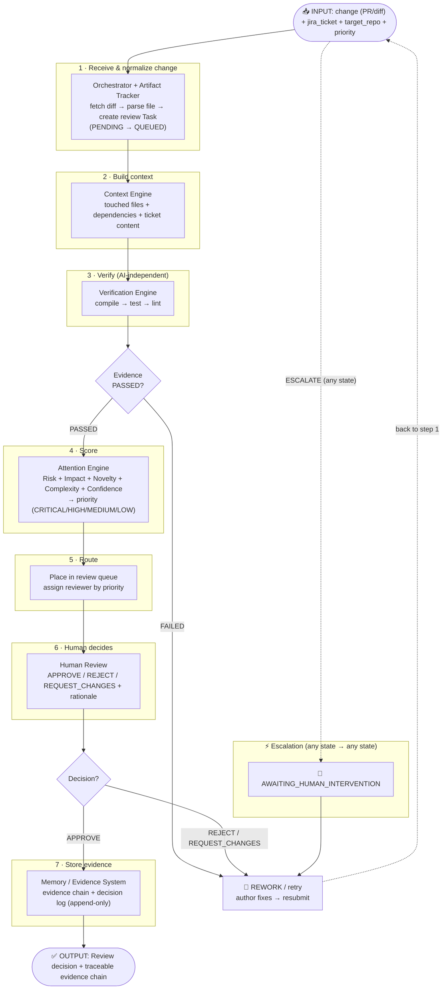
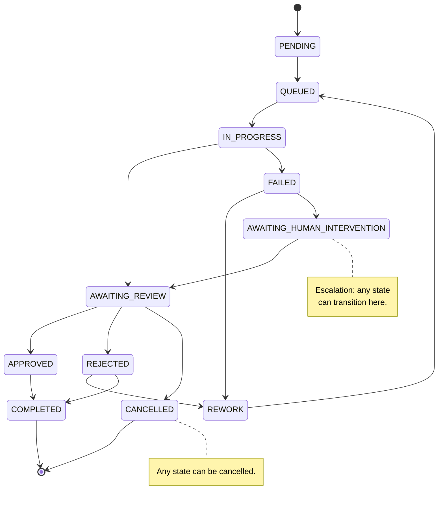
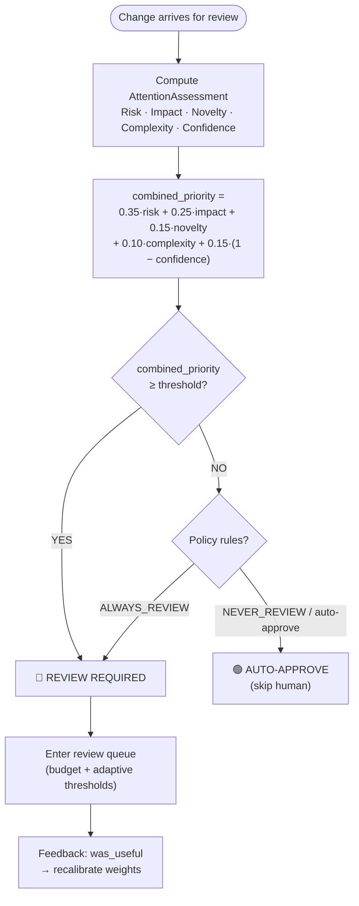
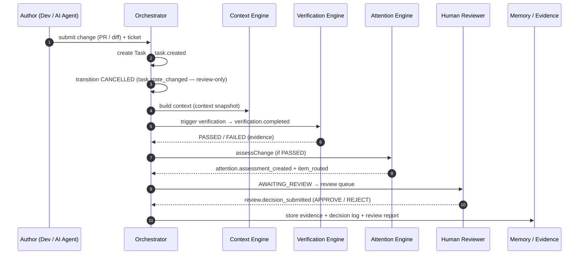
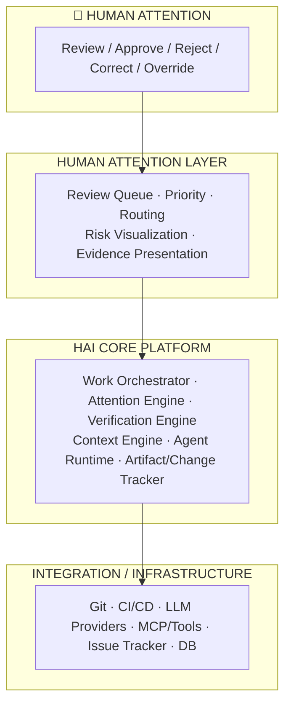

# HAI Harness — Operational Flow Overview

> **📍 Guide:** This is a flow summary of `docs/summary/HAI_overview.md`.
> For the full overview (4-layer architecture, 11 subsystems, domain objects, tech stack, roadmap),
> read **`HAI_overview.md`**.
>
> **`review-reorient` (v0.6):** The code-gen path is retired — the flow below reflects the **external PR/MR review** direction: AI is a _reviewer_ (read-only), no more "AI auto-generates fixes."

> **Human Attention Infrastructure (HAI) Harness** — an AI-native platform that manages and optimizes _"human attention"_ in software development:
> a code change (PR/MR) enters → Harness observes, verifies, assesses, uses AI to review, prioritizes, and routes to the right human attention.

Source: `docs/summary/HAI_overview.md`, `docs/architecture/HAI_Harness_Architecture_v0.6.md`, `packages/orchestrator/README.md`, `packages/attention-engine/README.md`.

---

## 1. System Context — HAI Between Humans and AI



Harness is the **control plane** sitting between: `Human ↕ Harness ↕ AI + Development Environment`.

---

## 2. Core Loop — "Code change in, Harness reviews & controls"

Core problem: **code changes (PR/MR) are produced faster than humans can review them → Human Attention becomes the bottleneck.**

```mermaid
flowchart TB
    AIOUT["Code Change<br/>(PR / MR — human- or AI-authored)"]
    OBS["🔍 Observation<br/>(fetch diff + metadata)"]
    UND["📖 Understanding<br/>(Context Engine)"]
    VER["✅ Verification<br/>(compile → test → lint)"]
    RISK["⚠️ Risk / Impact Analysis<br/>(Attention Engine)"]
    P ("Prioritization<br/>(rank review order)")
    DEC["👤 Human Decision<br/>(APPROVE / REJECT / REWORK)"]
    EVID["🗂️ Evidence / Memory<br/>(append-only, traceable)"]
    NEXT["🔁 Next Review"]

    AIOUT --> OBS --> UND --> VER --> RISK --> P --> DEC --> EVID --> NEXT --> AIOUT
```

Key milestone (Spec 1 §24): `AI Change → Evidence → Risk → Human Attention → Decision → Learning`.

---

## 3. End-to-End Flow — 7 Processing Steps (Input → Output)

Input is **one code change to review** (diff/PR) + context (`jira_ticket`). Main flow:



Exit condition: human decision (APPROVE/REJECT) + complete evidence chain.
Fallback: escalation to `AWAITING_HUMAN_INTERVENTION` at any stage.

---

## 4. Task State Machine



**Invariant (Spec 2):**

- State transitions use **optimistic locking** (`UPDATE ... WHERE id AND state = expected` → `StateConflictError`).
- `attempt_number` increments only on `REWORK → QUEUED`; idempotency key = `task_id:attempt_number`.
- All transitions are logged to `task_state_history` (audit).

Terminal states: `COMPLETED`, `CANCELLED`.

---

## 5. Attention Engine — Review Decision Logic



Labels: **CRITICAL ≥ 0.80 · HIGH ≥ 0.60 · MEDIUM ≥ 0.30 · LOW < 0.30**. Missing factor → redistribute weights + log `factors_unavailable`; all missing → default to HIGH (_fail toward attention_).

---

## 6. Event-Driven Timeline — Auditable



Every event is persisted **append-only** to `event_log` (idempotent), joinable by `correlation_id`.

Standard envelope: `{ event_id (UUIDv7), event_type, event_version, occurred_at, correlation_id, payload }` — naming `<domain>.<entity>_<verb_past_tense>`.

---

## 7. 4-Layer Architecture



---

## 8. Roadmap (Completed)

The full build roadmap (Core Loop → Calibrate & Measure → Learn & Automate) is complete, tagged `v0.4.0-harness` (`EXIT-WITH-CARRYFORWARD`, 8/9 exit criteria). Day-by-day branching history (`docs/plan/`) has been removed; exit summary at `docs/retros/phase3-exit-review.md`.
