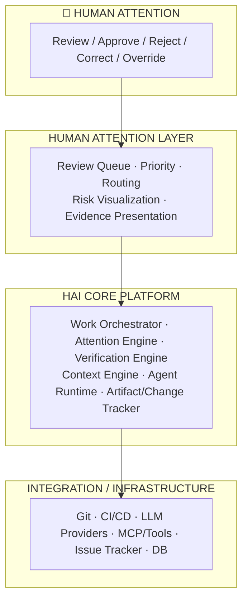
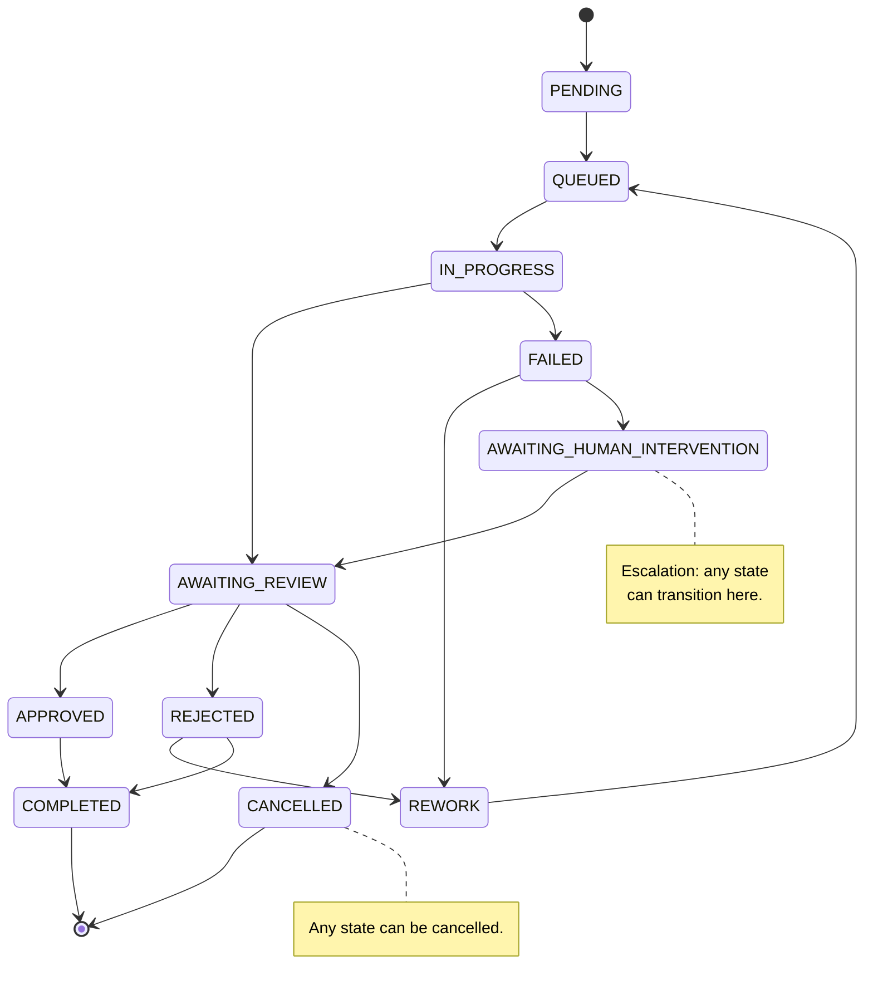
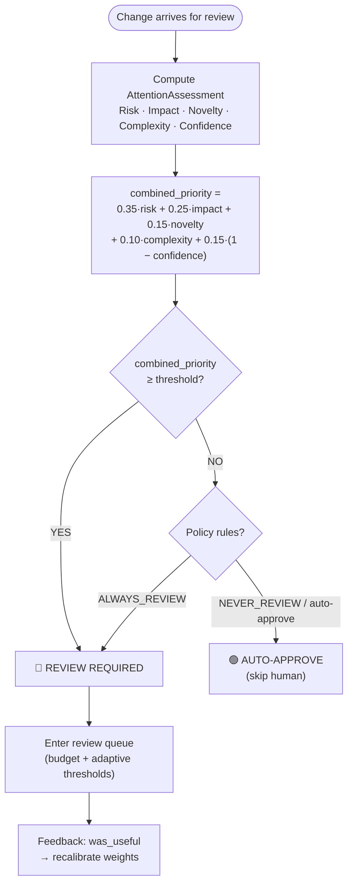
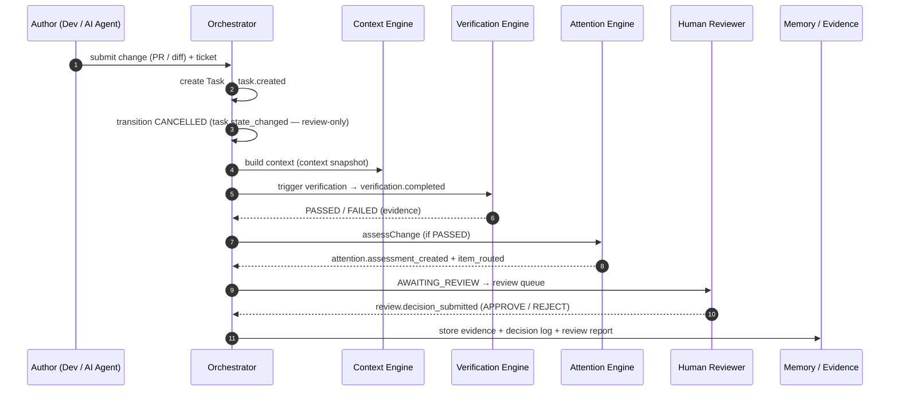

# HAI Harness Architecture Overview

> **`review-reorient` (v0.6):** The code-generation path is _retired_. The product is now a control plane for **external PR/MR review** (Bitbucket/GitLab/GitHub + Jira): AI acts as a _reviewer, not an author_ — it reads diffs + requirements and returns reports + findings + _fix suggestions_. Descriptions of "AI generates code / auto-fixes" in the sections below are design history only; the machinery (state machine, attention routing, verification, evidence) remains unchanged.

> **Completed (`v0.4.0-harness`):** MCP connectivity (GitHub/GitLab/Bitbucket/Jira via a single `mcp.config.json`, tokens via env — not inline), toggle-gated write-back with `writeback_log`, review memory, LLM-as-judge + inter-judge agreement, and a closed learning loop. Exit review: **8/9 criteria** — one item _hybrid search as default_ is carried forward (Day-29 A/B returned HOLD, `keyword` remains default). See `docs/retros/phase3-exit-review.md`.

## Overview

**Human Attention Infrastructure (HAI) Harness** — an AI-native platform that manages and optimizes _"human attention"_ in the software development process: a code change (PR/MR — created by a person or another AI) enters the system, Harness observes, verifies, assesses, uses AI as a reviewer, prioritizes, and routes to the right human attention.

---

## Core Problem

> **AI produces software changes faster than humans can review and validate them. Human attention becomes the bottleneck.**

The architecture treats "attention" as a measurable, routable, and optimizable resource.

---

## Input & Processing Flow (Input → Output)

### 1. Input — What Enters the System

The input is a **code change to review** along with its context — not "what needs to be done." Changes come from outside via PR/MR (GitHub today via REST; GitLab/Bitbucket/Jira connected via **MCP** — one client + one config file, no per-host REST SDKs); at the input boundary, HAI always receives **one change to review**.

| Field                  | Type   | Description                                                                                       | Example                                |
| ---------------------- | ------ | ------------------------------------------------------------------------------------------------- | -------------------------------------- |
| `pr_url`               | string | Pull / Merge Request URL — HAI fetches diff + metadata itself                                     | `https://github.com/acme/api/pull/482` |
| `jira_ticket` _(optional)_ | string | Associated ticket — criteria & context for cross-reference ("does the change properly resolve the ticket?") | `"ACME-1234"`                          |

> **Review-only flow:** Harness receives a PR URL, fetches the diff via MCP, fetches the ticket (if any), asks AI to review, and returns a report + findings + fix suggestions. No code generation, no auto-commit.

### 2. Progress — From Input to Output

Input (PR URL + ticket) goes through steps, each running when the previous one completes:

1. **Fetch diff + requirement** _(GitProvider + TicketProvider via MCP)_ — fetch PR diff, metadata (files, base/head SHA), and ticket requirement (Jira).
2. **Create Task anchor** _(Orchestrator)_ — create a `Task` review, immediately transition to `CANCELLED` (anchor provenance, no dispatch).
3. **Build context** _(Context Engine)_ — collect → rank → trim sources (keyword/hybrid/RAG Fusion), inject review memory.
4. **AI Review** _(ReviewAgent)_ — model reads diff + context, returns JSON: summary + overallVerdict + findings[] + suggestions[].
5. **Verification** _(VerificationEngine)_ — clone PR into Docker sandbox, run `build` + `test` of the clone. FAILED → flag report, don't fix code.
6. **Attention scoring** _(Attention Engine)_ — compute 5 factors → combinedPriority → label (CRITICAL/HIGH/MEDIUM/LOW) → route.
7. **Human decision** _(Review UI)_ — human reads report, approves/rejects/comments with rationale.
8. **Write-back** _(WriteBackService)_ — if armed, post comment/status on PR + transition Jira (toggle-gated).

---

## Architecture — 4-Layer Design

Each layer has a clear contract; internal details are implementation concerns.

---

## 11 Subsystems

### Domain Layer (Core Business Rules)

1. **Task** (Task entity, Spec 2) — State machine: PENDING → QUEUED → IN_PROGRESS → AWAITING_REVIEW → APPROVED / REJECTED / COMPLETED / CANCELLED; with REWORK and FAILED loops. Optimistic locking, attempt_number, audit history.
2. **Artifact** (Spec 3) — Immutable append-only log of code changes (commit, file set, parent, provenance). Single source of truth for "what changed."
3. **Evidence** (Spec 9) — Structured decision log: assessment + AI report + human decision + reasoning chain. Append-only, versioned, joinable via `correlation_id`.
4. **Context** (Spec 4) — `ContextSnapshot`: collected sources (diff, dependencies, ticket, codebase), ranked by relevance (BM25 / hybrid / RAG-Fusion), trimmed to budget.
5. **Attention** (Spec 5) — `AttentionAssessment`: 5-factor scoring (Risk, Impact, Novelty, Complexity, Confidence) → `combined_priority` → priority label → routing decision.
6. **Event** (Spec 1) — Domain events with strict naming (`<domain>.<entity>_<verb_past_tense>`), append-only, idempotent, versioned. Every transition has an event.

### Engine Layer (Technical Capabilities)

7. **Orchestrator** (Spec 2) — Central state machine coordinator; drives Task lifecycle, manages concurrency (in-process queue), coordinates cross-engine calls.
8. **VerificationEngine** (Spec 7) — Clone + build + test in isolated Docker sandbox. Returns `VerificationResult` (PASSED/FAILED + artifacts). Independent of AI.
9. **ContextEngine** (Spec 4) — Collects, ranks, trims, and assembles context from multiple sources for the AI reviewer.
10. **AttentionEngine** (Spec 5) — Computes risk/impact/novelty/complexity/confidence scores; applies adaptive thresholds; routes to review queue.
11. **ReviewAgent** (Spec 3) — AI reviewer (LLM provider abstraction); reads diff + context + ticket; returns structured JSON report with findings and fix suggestions. Read-only.

### Cross-Cutting

- **Memory/ReviewHistory** (Spec 9 §4) — Review memory: previous decisions, patterns, learnings injected into context to reduce repetition.
- **WriteBack** (Spec 8) — Toggle-gated: comment on PR, transition Jira ticket. Full audit trail in `writeback_log`.
- **Observability** (Spec 10) — Metrics, traces, structured logs. Health endpoint for index/status checks.

---

## State Machine (Task Lifecycle)

**Invariant (Spec 2):**

- State transitions use **optimistic locking** (`UPDATE ... WHERE id AND state = expected` → `StateConflictError`).
- `attempt_number` increments only on `REWORK → QUEUED`; idempotency key = `task_id:attempt_number`.
- All transitions are logged to `task_state_history` (audit).

Terminal states: `COMPLETED`, `CANCELLED`.

---

## Attention Engine — Review Decision Logic

Labels: **CRITICAL ≥ 0.80 · HIGH ≥ 0.60 · MEDIUM ≥ 0.30 · LOW < 0.30**. Missing factor → redistribute weights + log `factors_unavailable`; all missing → default to HIGH (_fail toward attention_).

---

## Event-Driven Timeline — Auditable

Every event is persisted **append-only** to `event_log` (idempotent), joinable by `correlation_id`.

Standard envelope: `{ event_id (UUIDv7), event_type, event_version, occurred_at, correlation_id, payload }` — naming `<domain>.<entity>_<verb_past_tense>`.

---

## Tech Stack

| Layer              | Choices                                                                              | Spec ref                |
| ------------------ | ------------------------------------------------------------------------------------ | ----------------------- |
| Backend            | Node.js 22 + TypeScript, PostgreSQL 16 (schema-first), Drizzle ORM                   | Spec 2 §2               |
| Container Sandbox  | Docker-in-Docker (rootless, no privileged flag, volume-bound source)                 | Spec 7 §4               |
| AI                 | OpenAI-compatible `LLMProvider` interface (Claude, GPT, open-source, local)          | Spec 3 §2               |
| Search             | PostgreSQL full-text (Phase 1); hybrid + semantic (Phase 3 seam)                     | Spec 4 §5               |
| Observability      | OpenTelemetry (traces + metrics), Prometheus endpoint, health endpoint               | Spec 10                 |
| Queue (optional)   | Durable queue (Redis/SQS) replacing in-process hand-off                              | Spec 2 §8               |
| MCP                | GitHub / GitLab / Bitbucket / Jira via unified `@harness/mcp` client + config file  | Spec 1 §3, §6           |
| Auth               | OIDC + session (`@harness/auth`); header-based for internal testing                  | Spec 1 §4               |

---

## Extensibility — Future Additions (No Spec Changes)

Post-v0.4.0 additions must slot behind existing seams without modifying contracts:

| Addition              | How it fits                                                                                        | Spec ref                |
| --------------------- | -------------------------------------------------------------------------------------------------- | ----------------------- |
| Vector DB (PGVector)  | Replace embedding provider impl; keep `Embedder` seam intact                                       | Context §5.1            |
| Semantic ranking      | New `Ranker` impl behind `Ranker` seam; keyword remains default                                    | Context §5.2            |
| Targeted verification | Filter files by context relevance before cloning                                                   | Verification §5         |
| Agent tools sandbox   | Restrict tool surface; add rate-limit + RBAC tiers                                                | Agent §14               |
| Memory consolidation  | Background retention / decay / archive; relevance scoring                                          | Memory §4.5             |
| Multi-agent           | Bounded autonomous loops + critique/revision (**not** replacing Human)                             | Was non-goal            |
| Benchmark             | Container runtime with minimal tools (bash + editor) + corpus gold labels                          | Spec 11 §5.1–5.2        |
| Judge                 | LLM-as-judge via `LLMProvider` (rubric-scored, audit)                                              | Spec 11 §5.1            |
| Queue (optional)      | Durable queue (Redis/SQS) replacing in-process hand-off                                            | Orchestrator §6 — **no** event contract change | 

> **Cross-cutting invariant:** Architecture remains a **modular monolith** (no microservices/K8s); Events still flow through the `IEventBus` interface; domain/engine dependency rules stay intact. Later additions only **expand infrastructure behind the seam**, without changing the contract.

---

## Roadmap (Completed)

The full 3-phase build roadmap is complete, tagged `v0.4.0-harness` (`EXIT-WITH-CARRYFORWARD`, 8/9 exit criteria):

- **Core loop** (`v0.1.0-harness`): Task → Context → Agent → Artifact → Verification → Attention → Human Review → Decision → Evidence.
- **Calibrate & Close the Measurement Loop** (`v0.2.0-harness`): Evaluation Engine v0 (metrics + A/B harness), calibrate attention weights from `was_useful` data, semantic search infra (shadow, behind Ranker seam), auto-approve behind flag + audit.
- **Review Control Plane** (`v0.4.0-harness`): MCP connectivity (GitHub/GitLab/Bitbucket/Jira via a single `@harness/mcp` client + `mcp.config.json`), toggle-gated write-back, review memory, LLM-as-judge with inter-judge agreement, and closed learning loop. Exit review: **8 of 9** criteria met → `EXIT-WITH-CARRYFORWARD`; one caveat (hybrid ranking not default — Day-29 A/B HOLD) carried forward (CF-1/CF-2).

Day-by-day branching history (`docs/plan/`, phase-1/2/3) has been removed; exit summary at `docs/retros/phase3-exit-review.md`.

---

## Intentionally Not Built

- Complex multi-agent orchestration · RAG/vector DB · sophisticated UI · autonomous loops · microservices/K8s
- Real auto-approve (r5 only sets flag) · Real SSO/auth (P0: currently only `X-Reviewer-Id` header)
- Semantic ranking, targeted/incremental verification (seams exist in interfaces)
- Code generation (AI writes code, commits, auto-merges) — retired in `review-reorient`

---

## Current State vs. Initial Review

Items that were "noted" in the initial review have since been addressed in specs:

- ✅ **Domain object schemas** — fully defined (12 task states, artifact/change lifecycle, evidence model, event envelope)
- ✅ **Data storage strategy** — PostgreSQL 16 for everything; clear conventions; append-only evidence
- ✅ **Error handling & fallback** — FailureClass (TRANSIENT/PERMANENT/RESOURCE), retry policy, escalation → AWAITING_HUMAN_INTERVENTION
- ✅ **Spec 9 (Memory/Evidence) & Spec 11 (Evaluation Engine)** — formalized from "later phase" notes into standalone specs: append-only Evidence store and Evaluation seam
- ✅ **Auth** — `@harness/auth` exists (`requireRole` + session/OIDC identity); full SSO remains out-of-scope P0
- ✅ **MCP connectivity** — GitHub/GitLab/Bitbucket/Jira via one config file
- ✅ **Write-back audit** — `writeback_log` + toggle chain (global + per-provider + per-decision)

**Conclusion:** The architecture stays on the right track (focus on the human attention bottleneck, evidence > confidence). It is now detailed enough to implement — with 11 subsystems (tight state machine, auditable event model), a clear roadmap, and step-by-step plans documented in the build history.
